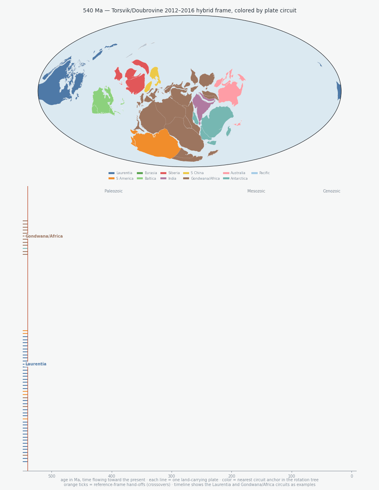
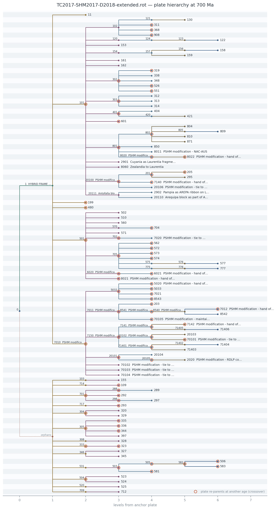

# rotree

Cladogram visualization of the plate-rotation hierarchy in any
[GPlates](https://www.gplates.org) rotation (`.rot`) file.

A GPlates rotation file encodes a *rotation tree*: every moving plate is
positioned relative to a fixed plate, which is positioned relative to
another, until the chain reaches the anchor (plate 0). `rotree` parses the
`.rot` file directly (no pygplates dependency), builds that hierarchy at any
reconstruction age, and renders it as a cladogram — so you can see at a
glance how a model is wired, where plates re-parent through time
(crossovers), and which plates never connect to the anchor.



*The Torsvik/Doubrovine 2012–2016 hybrid-frame model (Torsvik et al. 2012;
CEED6 land polygons) playing forward from 540 Ma to today. Top: a
pygplates + cartopy Mollweide reconstruction, each plate colored by its
circuit — the nearest anchor plate (Laurentia, Gondwana, Siberia, …) up the
rotation-tree parent chain at that age, so a reference-frame hand-off shows
up as a color change on the map. Bottom: the Laurentia and Gondwana/Africa
circuits as examples, each land-carrying plate a lineage against the shared
time axis, colored by the same scheme through time; the cladogram grows with
the moving cursor instead of re-arranging, and orange ticks mark the
hand-offs (crossovers). A spaced-out version with every circuit is at
[docs/rotree_reconstruction_full.gif](docs/rotree_reconstruction_full.gif);
regenerate both with
[docs/make_reconstruction_gif.py](docs/make_reconstruction_gif.py).*

## Install

```bash
pip install git+https://github.com/Institute-for-Rock-Magnetism/rotree.git
```

## Command line

```bash
# render the hierarchy at 600 Ma
rotree plot TC2017-SHM2017-D2018-extended.rot --time 600 -o tree_600Ma.png

# interactive version (plotly): hover any node to see how its reference
# frame is defined, every fixed-plate hand-off (crossover) it undergoes,
# and the .rot file's own annotations/citations with source line numbers
rotree html model.rot --time 600 -o tree_600Ma.html

# emphasize the Arabian-Nubian Shield plates
rotree plot model.rot --time 700 --highlight 50311 50312

# where does the wiring change through time?
rotree crossovers model.rot

# plain-text view
rotree tree model.rot --time 600
```



*The extended Torsvik & Cocks (2017) model at 700 Ma: branches colored by
depth, orange rings marking plates that re-parent at another age, and
unreachable plates on the dotted orphans branch.*

## Python

```python
from rotree import parse_rot, build_tree, plot_cladogram, save_interactive

model = parse_rot("model.rot")
ax = plot_cladogram(model, time=600, highlight={50311, 50312})
ax.figure.savefig("tree_600Ma.pdf")

# standalone interactive HTML with hover cards on every node
save_interactive(model, "tree_600Ma.html", time=600)

root = build_tree(model, time=600)
for crossover in model.crossovers(201):
    print(crossover)  # (time, old_fixed, new_fixed)

for x in model.crossover_details(201):  # hand-offs with their annotations
    print(x.time, x.old_fixed, "->", x.new_fixed, "|", x.after.comment)
```

## Interactive view

`rotree html` (or `save_interactive`) writes a self-contained HTML page
built with [plotly](https://plotly.com/python/) — install it with
`pip install rotree[interactive]`. Hovering a node, in particular the
bifurcation points where branches join a fixed plate, shows:

- the rotation segment pinning the plate at the chosen age (pole,
  time span, and the `.rot` source line number);
- every reference-frame hand-off (crossover) through time, quoting the
  file's `!` annotations before and after the switch — in well-annotated
  models these carry the citation or reasoning behind the frame choice —
  again with line numbers so each link can be traced back to the data;
- the plates the node carries at that age.

Nodes ringed in orange re-parent at some other age. Pass `--cdn` for a
small file that loads plotly.js from the internet instead of embedding it.

## Sidecar annotations

A `.rot` file records only the rotation tree; hand-drawn cladograms are
usually richer — named orogenies, arcs, rifts, and supergroups with time
spans and references. rotree accepts that curated knowledge as a sidecar
JSON file, keeping the rotation file untouched:

```json
{
  "events": [
    {
      "plates": [10100, 20100],
      "label": "Rigolet orogeny",
      "kind": "orogeny",
      "start": 1005,
      "end": 980,
      "ref": "Rivers (2008)",
      "note": "final Grenvillian collisional pulse"
    }
  ]
}
```

Each event needs `plates` (one id or a list) and a `label`; `start`/`end`
(Ma, either order — one alone makes a point event), `kind`, `ref`, `note`,
and `color` are optional.

```bash
rotree plot model.rot --time 990 --annotations events.json   # active plates drawn as diamonds
rotree html model.rot --time 990 --annotations events.json   # events join the hover cards
```

In Python, pass `annotations=` (a path, JSON text, or a list of dicts /
`PlateEvent`) to `plot_cladogram`, `save_cladogram`, `plot_interactive`,
or `save_interactive`. Hover cards list every event attached to a plate —
span, kind, reference, note — flagging those active at the plotted age.

## Notes

- Plate names are harvested best-effort from the trailing `!` comments on
  rotation lines; models without comments still plot with bare plate IDs.
- Plates with no path to the anchor at the chosen age are collected under a
  labelled `orphans` branch rather than dropped — useful for debugging a
  model's rotation-tree completeness.
- `999` moving-plate lines (GPlates' disabled-pole convention) are ignored
  unless `include_disabled=True`.

## License

MIT — Institute for Rock Magnetism, University of Minnesota.
